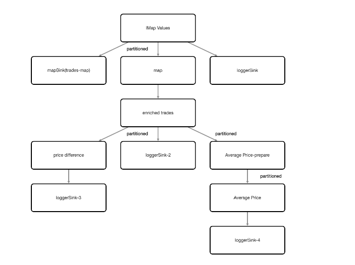

# TradeStream Project Description (Kafka Source)

Project consists of Hazelcast cluster, a reference data loader client,  a trade generator client and a TradeStream pipeline job.

The trade generator client produces fake trades (tradeId, tradeTime, symbol, quantity, price) into a kafka topic. 

The TradeStream Pipeline job consumes from the kafka trade event topic and does a number of actions on the trade event stream:

- Writes to console to show have received raw trade values
- Writes to trade-events-map to IMap
- Enriches the trade data with the company name for that trade symbol
- Writes enriched trades to console
- Writes enriched trades to enriched-trades-map
- Stateful processing to report if a price drops by more than 200
- Writes price drop to console
- Group the events by symbol. For each symbol, compute the average price over a 10s
  tumbling window.


  
### To compile:
`mvn install`

### Start kafka

Need to put this into docker but run from command line for now just to get code stored in a repo!
```shell
cd /opt/software/kafka_2.13-3.4.0
bin/zookeeper-server-start.sh config/zookeeper.properties
bin/kafka-server-start.sh config/server.properties


```
### Start Hazelcast and Management Center

```shell
hz start
hz-mc start
```
Look at management center, http://localhost:8080

### Load Reference Data
To compile (if not already compiled from initial mvn install):

```shell
cd refdata-loader
mvn package
```
To run:

```shell
cd refdata-loader
java -jar target/refdata-loader-1.0-SNAPSHOT.jar
```

### Submit TradeStream pipeline job:
To compile (if not already compiled from initial mvn install):
```shell
cd monitoring-pipeline
mvn package
```

To submit job:
```shell
cd monitoring-pipeline
hz-cli submit --class demos.pipelines.TradeStream target/monitoring-pipeline-1.0-SNAPSHOT.jar
```

### Run trade generator
To compile (if not already compiled from initial mvn install):

```shell
cd trade-generator
mvn package
```
To run:

```shell
cd trade-generator
java -jar target/trade-generator-1.0-SNAPSHOT.jar
```


